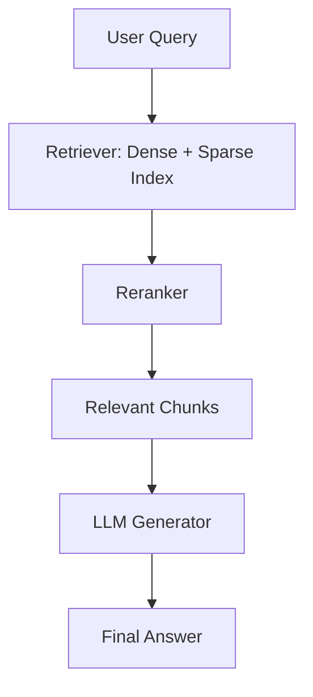
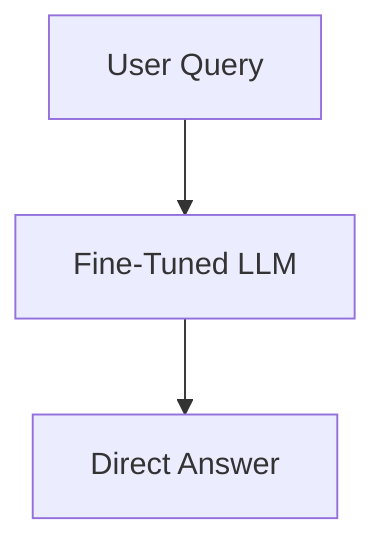

# Financial QA System: RAG vs Fine-Tuning  

A comparative study between **Retrieval-Augmented Generation (RAG)** and **Fine-Tuning** approaches for building financial question-answering systems.

---

## Objective
Develop and evaluate two approaches for answering questions based on financial reports:
- **RAG Chatbot** → Combines document retrieval with generative models  
- **Fine-Tuned Model** → Directly fine-tuned on financial Q&A data  

---

## Architecture Overview  

### RAG Chatbot Workflow

### Fine-Tuned Model Workflow


## Project Structure

```
financial_qa_system/
│
├── configs/                     # Centralized configs (no hardcoding)
│   ├── app_config.yaml          # Global settings (paths, logging level, etc.)
│   ├── finetune_config.yaml     # Fine-tuning configs
│   ├── gaurdrail_config.yaml    # invalid words etc
│   ├── logging_config.yaml      # logging configs
│   └── rag_config.yaml          # RAG-specific configs
│
├── data/
│   ├── raw/                     # Original raw data (PDFs, JSON Q&A)
│   │   ├── amazon_2023.pdf
│   │   ├── amazon_2024.pdf
│   │   └── qa_pairs.json
│   ├── qna/                     # qna created for fine tuning
│   │   ├── amazon_qa_dataset.json
│   ├── processed/               # Processed data (cleaned text)
│   ├── chunks/                  # chunks from processed text
│   └── embeddings/              # Vector stores (FAISS, ChromaDB)
│
├── logs/
│   └── system.log               # Consolidated logs
│
├── models/
│   ├── rag/                     # Saved RAG pipeline models
│   └── finetuned/               # Saved fine-tuned models
│
├── src/
│   ├── __init__.py
│   │
│   ├── utils/                   # Utility functions (shared)
│   │   ├── logger.py            # Logging setup
│   │   ├── config_loader.py     # Load YAML configs
│   │   └── evaluation.py        # Evaluation metrics
│   │
│   ├── data_processing/         # All data-related processing
│   │   ├── preprocess.py        # Cleaning, text extraction
│   │   ├── chunking.py          # Split into chunks
│   │   ├── dataset_prep.py      # Prepare Q&A dataset for FT
│   │   └── enhanced_text_cleaner.py # text cleaning utility
│   │
│   ├── llm_pipeline/            # common classes required for RAG and FineTuning
│   │   ├── base_qa_system.py    # Base class for RAGPipeline and FineTunePineline
│   │   └── guardrails.py        # Input and output guardrail implementation
│   │
│   ├── rag_pipeline/            # Retrieval-Augmented Generation modules
│   │   ├── pipeline.py          # RAG pipeline setup, safe_answer
│   │   ├── embed_index.py       # Build & store dense + sparse indices
│   │   ├── retrieval.py         # Hybrid retrieval logic
│   │   ├── reranker.py          # Multi-stage retrieval re-ranking
│   │   └── generator.py         # RResponse generation module
│   │
│   ├── finetune_pipeline/       # Fine-tuning modules
│   │   ├── baseline_eval.py     # Pre-fine-tuning benchmarking
│   │   ├── trainer.py           # Fine-tuning loop
│   │   ├── instruction_ft.py    # Supervised Instruction Fine-tuning
│   │   ├── pipeline.py          # Fine-tuning pipeline setup, safe_answer
│   │   └── guardrails.py        # Fine-tuning guardrail
│   │
│   ├── interface/               # Frontend/UI
│   │   ├── app.py               # Streamlit/Gradio entry point
│   │   └── components.py        # UI components (switch modes, display confidence, etc.)
│   │
│   └── deployment/              # Model & pipeline loading for inference
│       ├── load_model.py        # Load saved fine-tuned model
│       └── load_rag.py          # Load vector store & generation pipeline
│
└── tests/
    ├── test_rag.py              # Unit tests for RAG modules
    ├── test_finetune.py         # Unit tests for fine-tuning
    └── test_interface.py        # UI and integration tests
```

## Quick Start

1. **Setup Environment**
   ```bash
   git clone <repository-url>
   cd financial_qa_system
   pip install -r requirements.txt
   ```

2. **Prepare Data**
   - Place your financial reports in `data/raw/`
   - Ensure Q&A pairs are in `data/qa/qa_pairs.json`

4. **Launch Interface**
   ```bash
   >>> cd ~/financial_qa_system
   >>> export PYTHONPATH=$PYTHONPATH:$(pwd)/src
   >>> streamlit run src/interface/streamlit_app.py
   ```

## Features

### RAG System
- **Multi-stage Retrieval**: Dense + Sparse hybrid retrieval with re-ranking
- **Flexible Chunking**: Multiple chunk sizes (100, 400 tokens)
- **Advanced Indexing**: FAISS vector store + BM25 sparse index
- **Guardrails**: Input validation and output filtering

### Fine-Tuning System  
- **Supervised Instruction Fine-Tuning**: Custom Q&A training
- **Efficient Training**: Gradient accumulation and learning rate scheduling
- **Model Checkpointing**: Resume training and model versioning
- **Baseline Benchmarking**: Pre/post fine-tuning comparison

### Evaluation Framework
- **Comprehensive Metrics**: Accuracy, speed, confidence scoring
- **Robustness Testing**: Relevant, irrelevant, and edge-case questions  
- **Statistical Analysis**: Detailed performance comparison
- **Visualization**: Interactive results dashboard

## Configuration

- app_config.yaml - Application configuration
   * Central entrypoint for project settings
   * Defines data/model/log paths 
   * Controls default UI type (Streamlit/Gradio/CLI)

- finetune_config.yaml - Fine-tuning parameters
  * Defines dataset splits for training/validation/testing
  * Sets model & training hyperparameters
  * Enables instruction-style fine-tuning
  * Controls logging & guardrails during training

- gaurdrail_config.yaml
  * Rejects irrelevant questions (e.g., weather, sports, trivia)
  * Ensures Query and Answer remains focused on financial domain
  * new word tokens can be added to this file.

- rag_config.yaml - RAG-specific settings
  * Controls preprocessing (chunking size & overlap)
  * Defines embedding model & vector index type (FAISS/BM25)
  * Configures retrieval fusion (dense+sparse weighting)
  * Enables reranking with cross-encoder
  * Specifies generator model and output length
